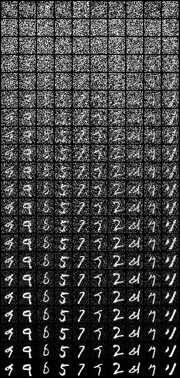
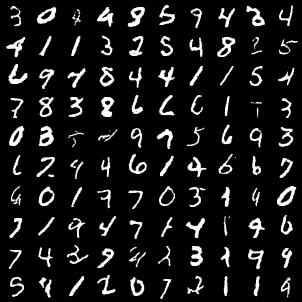
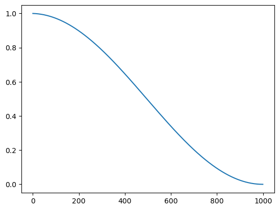

# DDPM

Previously, the code has some issues (I used `alpha_bars = alphas[:]`, which lead to the change of `alphas` when `alpha_bars` changes). Now I have fixed it.

I found that the keys to implement the U-Net structure for diffusion are:

- a proper noise schedule (the cosine schedule is a good choice)
- large models (in contrast to VAEs, which can be small), since the model learns a harder task
- residual connections and attention (with residual connections) can help. Remember to initialize the residual parts as an identity function
- small learning rate and train for a long time (~100 epochs)
- in case of training instabilities, try to use layernorm

The final model isn't that good, with an unconditional FID of 33. The model has 2M parameters, and it takes a morning to train on a V100 GPU for 90 epochs. The loss can still descent; but due to computational constraints, I don't want to train it more.

## Visualization

Diffuse:

Samples:

The loss curve (loss vs. diffusion time step), unfortunately, got lost on the remote server. Generally, (with the cosine schedule), you should expect the loss to only be high at first ~30 steps, then stable at the middle, and achieve near zero at the end (900~1000).

## Why cosine schedule works

This is the plot of $\bar{\alpha}_t$ versus $t$, which is close to a cosine function. This schedule is good since there is both difficult (high $\bar{\alpha}_t$) tasks and easy (low $\bar{\alpha}_t$) tasks. The model can learn the easy tasks first and then gradually learn the hard tasks. This is a good way to train the model.

## Code References

[github repo from original paper](https://github.com/hojonathanho/diffusion)