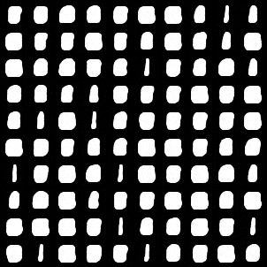
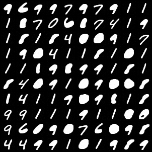
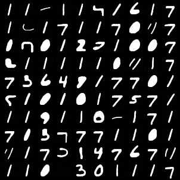
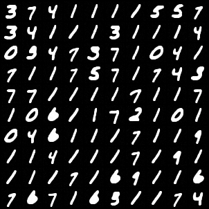
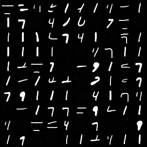

# DDPM

## Loss is always 1
Find out the problem: the output is 0! 

**note**: the output is only 0 after several epochs. That's why I don't find that in the beginning.

Modification 1: **replace `ReLU` in the `Res`; use LeakyReLU.**

Modification 2: Use U-net structure: cross-connection.

## Then, loss decreases but the model can only learn 1 and 7

Here is an example failure image.

Modification: Add attention.

Attention should contain `out_proj`.

## Study: the effects of hyper-parameters: $\beta_1,\beta_T$ and $T$

- $\beta_T(\sim 10^{-2})$: if decrease, then the loss will start with a lower value, but also decreasing slower.

- Change back to `ReLU`

- $T=200$: fails badly
- $T=50$: The generated results are partial.

- Add `Dropout`: totally failed.

## Summary

The training of Diffusion Models are very different from the previous generative models (like VAE). The model can collapse at any time, but recover very soon. Until the valid loss collapses, you still have chance to find a good result between garbages.

The training statistics are listed in the log file in the folder, and are ploted below.

## Code References

[github repo from original paper](https://github.com/hojonathanho/diffusion)