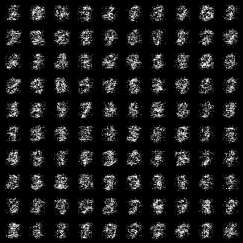
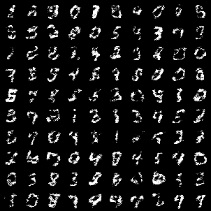
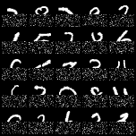
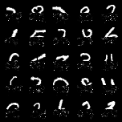
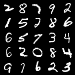
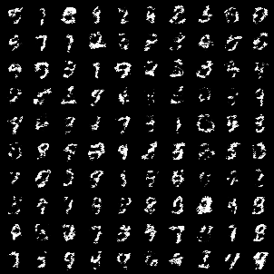
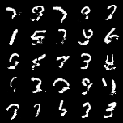
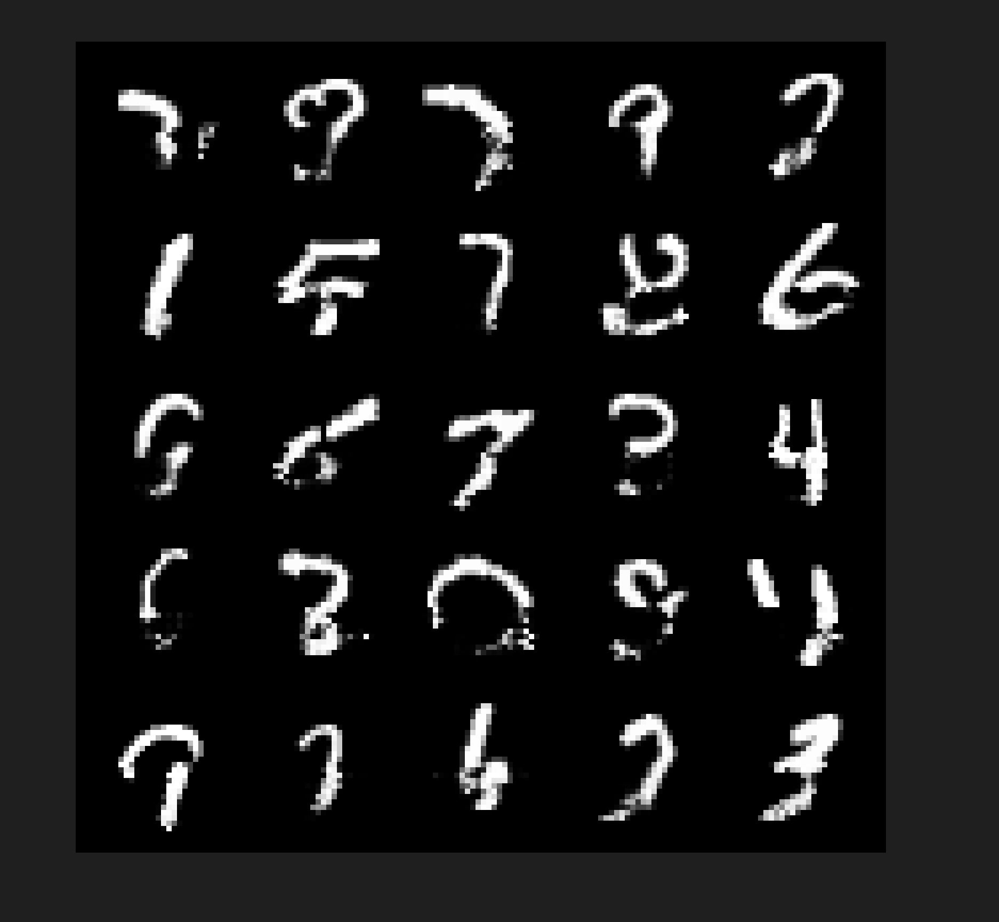

# Note

This trial is not very good. So don't reference much from this note when writing flow for (maybe) the next time.

# Flow

This cost me a lot of time (and money!!!). 

The following is more like a "diary" than a note. It takes down my sinuous path on struggling with the model.

## Initially: Small Bugs

1. Loss is `nan`: should use `Tanh` in last layer of `alpha` net.
2. Logdet: logdet should be `alpha*(1-mask)`, instead of just `alpha`. (I found this by carrying out backward tests and log-det tests).

Okay, okay. They are fixed and the model should work now.

## But it can't work at all.

The image is just like random noise, there is no sign of any pattern. (典)

1. The log prob is very large **positive** number (around 700). It contradicts the experience in [CP3](https://github.com/ZhaoHanHong/DL_2024Sp_CP3/).
2. I thought that I have written some bugs. But I seemed to pass all my tests??? Moreover, the validation result is similar as the training result, so my model isn't overfitting??? I am really confused.

I tried to consider:
- Is the accuracy insufficient? In my test, I found that the $x\to z\to x$ process lead to some difference (around `1e-4`). I changed it to `float64`, then there is no such error. But it makes the training process slower. (I changed it back afterwards)
- Is the initialization bad? (No progress)
- Should I wait for more epochs? Or maybe tune the hyperparameters? (No progress)

And I tried to debug:
- I gathered the `z` corresponding with `x` that are picked out from the dataset.
    - If I do nothing with `z`, and backward it to `x`, the result is fine images (of course)
    - If I add perturbation to `z` (around order of 0.1), the result is still fine, but can see some noises.
    - If choose another set of `z`, which are sampled from unifrom Gaussian, then the corresponding `x` is very bad. (No visible images.)
    - Thus, I tried to measure the mean and variance of the original `z` (those corresponding to `x` in dataset). The mean and std are all somewhat far from uniform gaussian (I thought that the maximum and minimum entry of mean can reach 2, and the minimum entry of std is just 0.001).
- I also tried to plot `z` by random projecting it on two basis. It lookes like a gaussian; but later one of my friends told me to visualize the radial distribution of `z` (i.e. the distribution of `z.norm(dim=-1)`). It is far from uniform gaussian (for a gaussian, the radial distribution should be really sharp; but the distribution for `z` is rather flat.)

Thus, I concluded that **my model can't make `z` to be uniform gaussian**. So even the reconstruction is great and the loss is small, the sampling process can't get `z` in the model's desired distribution. 

How can I fix that???

## Then I gave up and reference for CP3 😢

I found some differences (except the main architecture difference): CP3 has done the following...

1. `pre_process`: before passing into any layer, it first turn `x` to `logit(x)`, which is implemented by `(x+1e-5).log()-(1-x+1e-5).log`, to avoid nan values. Moreover, this is treated as **a transform on the dataset, so its logdet isn't calculated**.
2. It has a batchnorm layer. Also, it has a significantly larger batch size (500). 

I still don't now why they are important. But after I add on them, it changed.

Though the images aren't very clear, at least they *have some patterns*, the most significant being the black background on four sides. Moreover, the log prob becomes negative (though being very large in abs value, -20000). However, I know that this is just a cheat, since `pre_process` must have a significant logdet, which is not taken into account.

## Then I realized why `pre_process` is important

1. The actual log prob **should indeed be positive**. In coding project 3, the log prob is negative, but it is due to the `pre_process` (mentioned above), which contributes a logdet, but is ignored.
2. Think: $\frac{|z|^2}{2}$ in the Gaussian log prob isn't very large (theoretically, just $d/2$, where $d=784$ is the dimension of $z$ and $x$). However, the log jacobian should be large:
    - $x$ takes volume $V\le 1$ in the 784-dim space. 
    - However, $z$ should be isotropic Gaussian, which takes an exponentially large volume in high dimensional space. (An estimation, by Gaussian Annulus Theorem, radius is around $\sqrt{d}$; let we pick the radius to be $0.9\sqrt{d}$ to $1.1\sqrt{d}$, which takes a considerable ratio of the mass, then it can be estimated as $0.2V_d\times (\sqrt{d})^{d} $, which turns out to be order of $(e\pi)^d$.)
    - Thus, $\log \det \frac{\partial z}{\partial x}$, which represents the change of volume, should be really large (modestly speaking, at least $d\sim 2d$.)
    - Maybe this is not mathematical rigorous, but it gives some sense.

Thus: without `pre_process`, the log prob will be positive. **The usage of `pre_process` is to extend the space that inputs take.** Why that helps the generation quality? I think maybe it is significantly harder for a model to train on the restricted space ($[0,1]^{d}$).

(From another perspective, you can regard the `logits` of images as "real data", and using the image is equivalent to taking a `sigmoid` on real data. This will lead to gradient vanish in some cases.)

## Issues with `BatchNorm`

I also tried to add the batchnorm. I notice that the implementation in CP3 can be described as:

- when training, use the real `mean` and `var` for the current batch and do normalization (with parameter `eps` to avoid divide-by-zero)
- when training, also update running (i.e. using momentum update) `mean` and `var` parameters using the pytorch method `register_buffer`. This method is specifically designed for parameters that doesn't `requires_grad`.
- when evalutaing, only use the running `mean` and `var` for normalization.

(The implementation also adds a "linear" layer after the batchnorm, but it may not be very important.)

For this implementation to work, it is clear that the difference between the statics of batches should be small. Thus, only with large batch size can this work well. (It is very sensitive to batch size.)

Here is a **issue**: I tried to directly add the batchnorm network in CP3 into my code. However, the validation loss explodes! (of order $10^{18}$). I can tell that is due to the fluctuation of the batch statistics. But the code *indeed works*
 in CP3. I cannot find out the exact reason.

Thus, I finally **removed** the `BatchNorm` layer.

## New Ideas

I decided to add **residual network** (`Res`) into `Coupling` layer. Moreover, I add a MLP projection head for convolution layers in `Coupling`. (**Never forget to add MLP heads for Conv Layers!!!**)

This gives something like

(The image is significantly worse than other models, but it is the best I can get). The model is trained for 70 epochs, and the final loss is around 700 (log prob is -700). The model has 5M parameters.

## What about Impainting?

I then tried to use the model for impainting, failure.

Why? Same reason as before. You can't use the image directly to backward, since it again lose the gradient through sigmoid. The image hardly changes.

The correct implementation in CP3 is a little tricky: we first calculate $x'=\text{logit}(x)$, and then use the model (but **without** pre_process) to do gradient descent on `x'`. Then we use `sigmoid` to get the final image.

With this, the images can change. However, the final quality is far from CP3. See below: corruption, recovered, ground truth.

## Final Discussion on Impainting

I can't exactly tell why my model is worse than CP3 when it comes to impainting. However, I notice that the model in CP3 **can give a reasonable impainting image in epoch 0, despite the generation result at that epoch is very bad** (like figure 1 above). I have also notice some other facts:
- Pick `x` from dataset, and add a little perturbation (0.05) to get `xp`. The difference of log prob between `x` and `xp` is significantly larger for our model than CP3.
- During the impainting process in CP3, the model can immediately reach to a similar log prob compared with the ground truth image. The optimizing process can even reach a higher log prob than the ground truth image. In contrast, our model struggles to increase log prob even when the log prob is five times pf the ground truth image.

Thus, I believe that the problem of our current model is that **the log-prob function of it is too complex to optimize**. This may be due to the large number of parameters and the depth of the model.

## Conclusion ...?

I think this trial of flow model as a **failure**. For a better performance, **the structure of CP3 should be used**, which can get good generations with less parameters, and yield better impainting results.

## But [Luyy](https://github.com/Lyy-iiis) helped me to find the bug

See commit 2ef675c, I apply `tanh` and residual connection twice unintentionally. This isn't a serious bug, since the `log_det` and backward pass are all not harmed. However, this somehow matters.

With the change, I can get the generation result like:

well.. only slightly better. However, the impainting has a significant improvement! I first observed that the log prob can be optimized more easily. Then with the aid of `Adam` optimizer, I finally get the following impainting result (with the same corrupted and ground truth images as previous):

With enough time of impainting, the final result can be like

This has less than half of the mse for corrupted image.