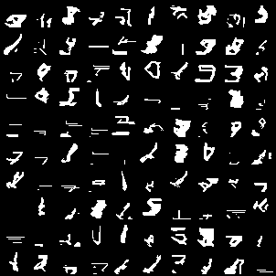
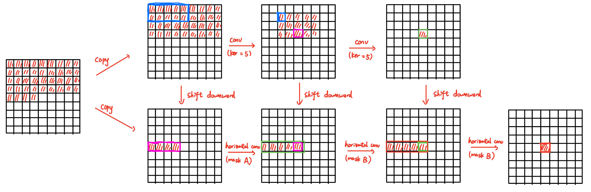
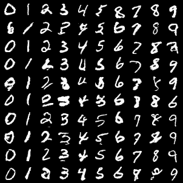
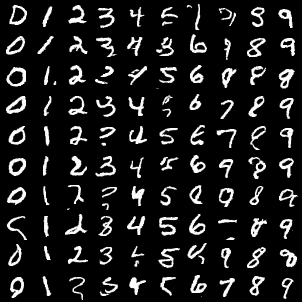

# PixelCNN and Gated PixelCNN

## PixelCNN

1. Shouldn't use binary classification, because it's hard to train. (generated result is bad.)
    
2. Use residual connection make things better.

Final model has 4M parameters, train for 20 epochs. The model overfits quickly, so use a large weight decay (1e-4). I am lazy to tune further, so here is it:

the loss is around 450.

## Gated PixelCNN

Here is a brief illustration on how the vertical and horizontal stack works.

### Experiment

1. Bug: the model cheats, so the loss is low but sample is all empty. Reason: copilot wrote the mask wrong :(

After fixed bugs, the model can do conditional generation:

The loss is around 490, but since the task is conditional generation, it is not very comparable with previous PixelCNN. However, by looking at the images, clearly the Gated PixelCNN is better.

The model also has 4M parameters, and is trained for 40 epochs.

It can be noticed that the label sometimes goes wrong. This is reasonable, since we use the formula in the paper, which **adds** the contribution on label with the outputs of the image. Thus, if the image part is significantly larger, maybe the label will be ignored.

Adding residual connection on the model doesn't lead to significant improvements.

# References

- [PixelRNN](https://arxiv.org/abs/1601.06759)
- [Gated PixelCNN](https://arxiv.org/abs/1606.05328)