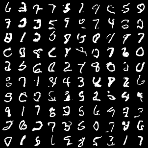

# PixelCNN and Gated PixelCNN

## PixelCNN

1. Shouldn't use binary classification, because it's hard to train. (generated result is bad.)
    
2. Use residual connection make things better.

Final model has 4M parameters, train for 20 epochs. The model overfits quickly, so use a large weight decay (1e-4). I am lazy to tune further, so here is it:

the loss is around 450, let's take it as a baseline for gated PixelCNN.