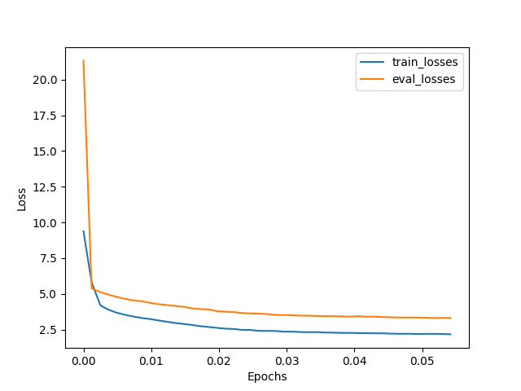

# Transformer

## Bugs

1. Mask issues (how to add it to attention scores; how to construct the mask)
2. `nn.Transformer`: the output is irrelevant to the input. Why?
    - Reason: don't add `tgt_is_causal` in forward call :( Just use the target causal mask.
3. Batch size matters: at least 10 for a stable training.
    - Remove outliers (very long sentences) in dataset by clamping them to max length 100. This can let the batch size be 64 without using up the CUDA memory.
4. Implementation: all decoder layers should attend on **last layer** output of encoder layers. Reason: regaurd encoder and decoder as separate modules. The task of encoder is to encode the sentence, with each word become some feature (dim:`embed_dim`). So the decoder only has to use the final result of encoder.
5. `F.dropout` need to specify `training=self.training`


## "Success" Translation Examples

The final perplexity is around 30. The model has 58M parameters. The model is trained on around $20000\times 64\approx 1\text{M}$ sentences pairs, which corresponds to less than 6% of the training dataset.


For hyperparameters, we use the default setting in the paper. The model is a bit overfitting.

The model did pretty well in short sentences

```
English: <bos> pakistan will continue to make every effort to promote corridor construction <eos>
(generated) Chinese: <bos>巴基斯坦将继续努力促进持久性建设<eos>
(true) Chinese: <bos>巴方将继续全力推进走廊建设<eos>
```

```
English: <bos> in <unk> ' s program , we will cover the following main content . <eos>
(generated) Chinese: <bos>在<unk>的方案中，我们将涵盖以下主要内容。<eos>
(true) Chinese: <bos>首先为您介绍今天节目的主要内容。<eos>
```

and sometimes reasonable in long sentences

```
English: <bos> de <unk> said that while <unk> china on entering a new era , he will continue to devote himself to developing cooperation between france and china and europe and promote cooperative fields , such as bilateral cyberspace governance . <eos>
(generated) Chinese: <bos><unk> <unk>说，虽然中国的发展中国家继续发展新日子，但继续发展中国与中国和欧洲和欧洲之间合作领域的合作，例如双边政治领域。<eos>
(true) Chinese: <bos>德维尔潘表示，祝贺中国进入新时代，他将继续致力于发展法中和欧中关系，促进双方网络空间治理等领域合作。<eos>
```

```
English: <bos> we must <unk> adhere to the principles of the constitution , carry forward the spirit of the constitution , fulfill the mission of the constitution , and give full play to the important role of the constitution in successfully building a well - off society in an all - around way <eos>
(generated) Chinese: <bos>我们必须坚持《宪法》的原则，即《宪法》的精神，使宪法任务完成重要的作用以及在全面建立和谐的社会方面发挥重要作用。<eos>
(true) Chinese: <bos>更加坚定自觉地恪守宪法原则、弘扬宪法精神、履行宪法使命，更好发挥宪法在决胜全面建成小康社会<eos>
```

```
English: <bos> when meeting with <unk> , li <unk> said he hopes both sides will continue to follow the principle of the market and speed up cooperation on cross - border transport infrastructure and construction , <eos>
(generated) Chinese: <bos>当时，李长说他希望双方继续跟进市场合作的原则以及加速合作开展跨国道路基础设施和修建工程的原则，<eos>
(true) Chinese: <bos>在会见伊萨科夫时，李克强表示，希望双方继续遵循市场化原则，加快推进有关跨境交通基础设施建设合作。<eos>
```

(In the examples, we have deleted the pad tokens for simplicity. In real generation, we add up to 50 pad tokens at the end of source sentence.)

## The `nn.Transformer` module

With the same settings, the `nn` model has similar amount of parameters. However, the training of the `nn` model is significantly slower and more unstable. I can't tell why. The final perplexity is more than 40.



The generation results are somehow amusing.

```
---Generation---
English: <bos> xi <unk> pointed out in his <unk> message that at present , a new technological and industrial revolution represented by information technology is in its infancy , with a strong momentum into economic and social development . <eos>
(generated) Chinese: <bos>第十五条，他指出，目前正在信息技术和工业革发展的新技术和工业革发展的新技术和工业革发展的信息。<eos>
(true) Chinese: <bos>习近平在贺信中指出，当前，以信息技术为代表的新一轮科技和产业革命正在萌发，为经济社会发展注入了强劲动力。<eos>
```

```
English: <bos> both sides agree to step up cooperation in tourism and aviation and to closely promote humanities exchanges between the two countries . <eos>
(generated) Chinese: <bos>双方致力于旅游和通过旅游和航空国家的合作和航空间交流。<eos>
(true) Chinese: <bos>双方同意加强旅游、航空合作，密切两国人文交流。<eos>
```

```
English: <bos> <unk> armed forces and saleh formed an alliance in late 2014 to fight the legitimate government led by yemeni president <unk> . <eos>
(generated) Chinese: <bos>独立武装部队和马里武装部队在2014年底举行了一个独立政府的建筑。<eos>
(true) Chinese: <bos>胡塞武装和萨利赫于二零一四年底组成同盟，对抗也门总统哈迪领导的合法政府。<eos>
```