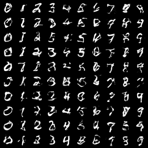
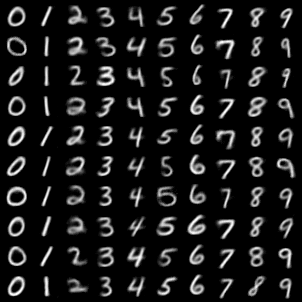
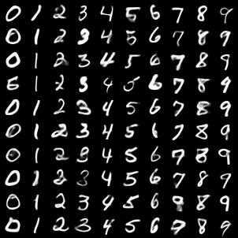
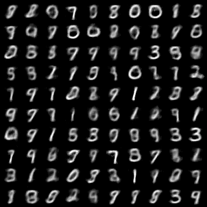

# VAE

## Bugs I have written

1. Always: Shape issue when calculating reconstruction loss. The bug comes from distribution.sample
2. The distribution $p_{\theta}(x|z,y)$ indeed should have variance 1. I used to change it to 0.01, but it make things significantly worse. Afterwards, I realized that this corresponds to $\beta$-VAE with $\beta=10$, which is not a good idea.

Here is an example of the bug 2 image:

When bug 2 happens, the KL divergence is around 170, which is not correct. Meanwhile, the reconstruction loss is reasonable and the reconstruction image is successful. However, since the distribution of latent variable is no longer isomorphic gaussian, the generated images are not good.

## Successing Experience

- Learing rate doesn't matter
- Network Size doesn't matter (as it is reasonable)
- Network Structure doesn't matter
- Don't need train too much epochs (if you are not persuing something strict, like FID. For entertainment, several decade of epochs are enough for people to recognize the numbers)

## Ablation Study

I changed the `x_var` in the code. Increasing it leads to a more "fluffy" image, but decreasing it too much whould lead to bug2 shown above.

`x_var=1`: When `x_var=1`, there is a certain probability for the training process to **die**! This means that KL divergence reach its theoretical minimum (50.0), and the reconstruction loss doesn't change (around 40). This leads to completely dark image (value<0). However, if the process doesn't die, the final image is like below.

`x_var=0.1`:

`x_var=0.01`: failure (as mentioned above)

No matter how large `x_var` is (which influences the size of reconstruction loss), the final reconstruction loss and kl divergence are all between 10 and 100.

## Ablation Study on Labels

How to add the label information in? Here are several choices.

### How much labels to add in

The "how much" is decided by repeating the one-hot vector of the label for how many times. Emperically, the size depends on the size of the vector that it concatenates with. They should be in the same order (i.e. in multiple of 10).

The default value is repeat 5 times. However, it doesn't matter. The final image is similar.

### Where to add in

#### Add both in encoder and decoder

This is the default methods (i.e. all previous images are using the method) 

#### Add only in decoder

No significant changes.

#### Add only in encoder

This leads to completely failure (see below), which is reasonable.

## Others

1. The hyperparameters don't matter when dealing with "work or not" problem. When the model don't work at all, the loss must be wrong.