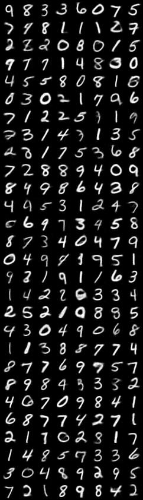
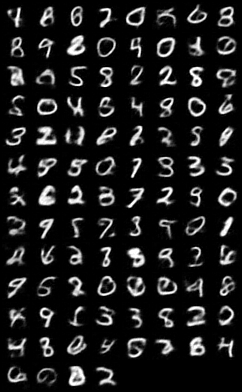
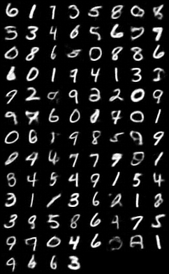

# VQVAE

Please note that it is important to back-propogate the reconstruction loss to encoder by copying the gradients from the decoder to the encoder. It is mentioned in the paper.

## Main issue: don't use `argmax` in nearest neighbor :(

Use `argmin` instead.

## Updates

The key hyperparameters to adjust are:

- The latent size $h\times w$
- The latent dimension $c$
- The number of embeddings $K$

Using a latent size of $2\times 2$, latent dimension 4 and 64 embeddings already give good results. The model only have `0.3M` parameters. This actually means that VQVAE is a quite good model for small datasets.

The reconstruction result is shown as:

As the latent size is quite small, there is no strong correlations between pixels. Thus, uniformly sampling 4 integers from 0 to 63 already give pretty good sample images:

Of course, we can learn the latent further, but not with PixelCNN. The model is too large for the small dataset. We use a simple `LSTM`, in `lstm.py` (actually, `pixel.py`, which implements the `PixelCNN` model, is not used finally).

The LSTM model has only 40k parameters, and it can be trained within a minute. The final cross-entropy loss is around `3.4`. 

We can see this generation is better than the uniform sampling.

## What I have learned (recently)

Actually, MNIST is quite a simple dataset. The model don't have to be pretty large, and the latent size can be quite small. 

Also, start simply. For example, sometimes a badly designed conv net can even be worse than MLPs. Don't try to make the model wider or deeper if it isn't working. Always check your implementation correctness first.